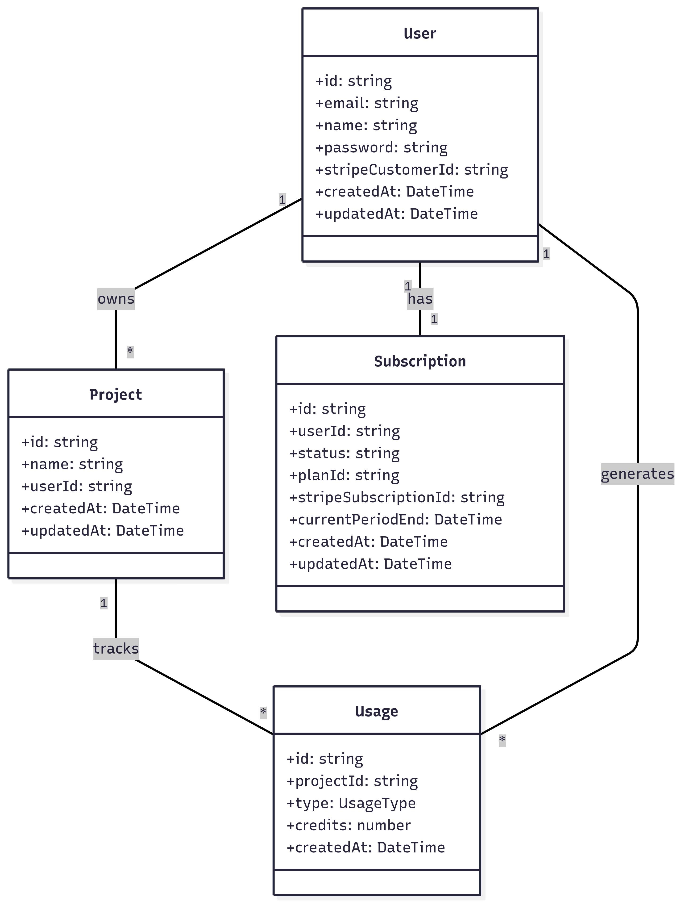
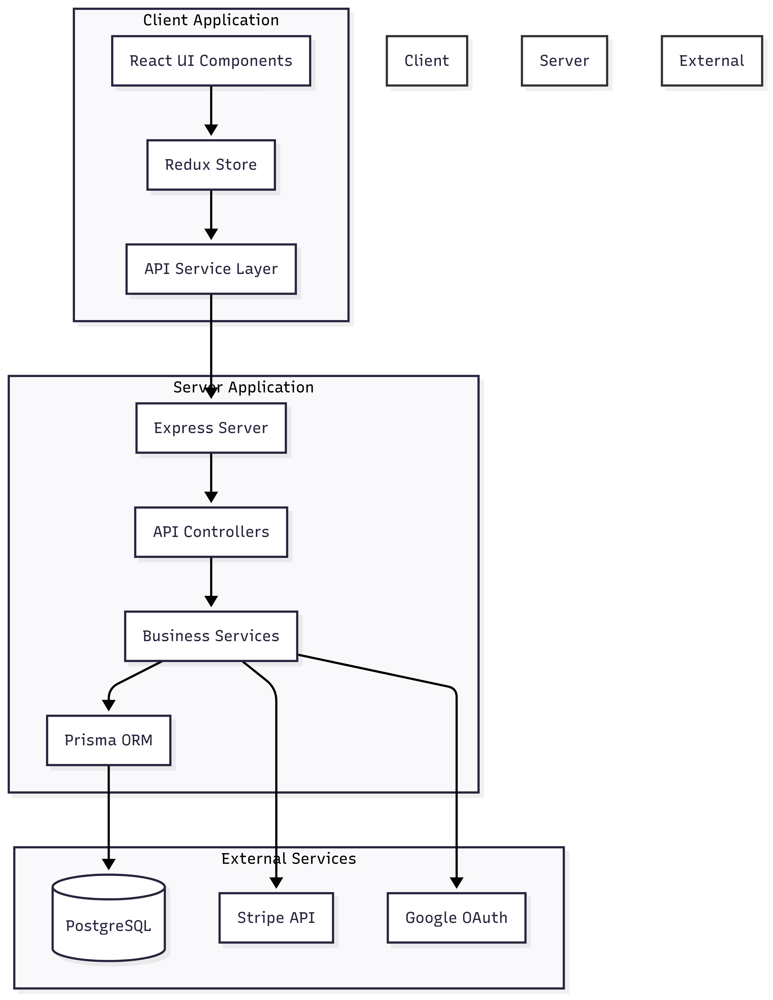
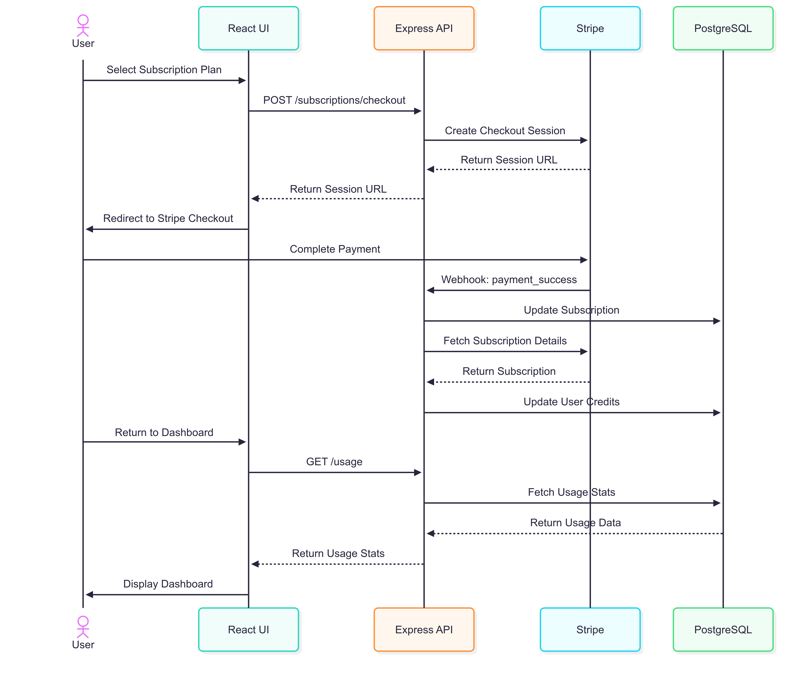

# AI Subs Architecture

This document outlines the architecture, system design reasoning, and key decisions behind the AI Subs platform.

---

## 🗂️ Data Models

We use a normalized schema with four core entities:  
- `User` owns multiple `Project` records  
- Each `User` has one `Subscription`  
- Each `Project` generates multiple `Usage` records

This separation supports granular usage tracking, modular billing, and clear ownership boundaries.

---

## 🧠 System Architecture

The app is split into client and server layers, with clearly defined responsibilities:
- Client: React + Redux for UI and auth state
- Server: Express + Prisma for API logic and DB access
- External: Stripe (billing), PostgreSQL (DB), Google OAuth (auth)

This separation improves scalability and makes it easier to test, extend, or replace any component in isolation.

---

## 🔁 Subscription Flow

The checkout flow uses **Stripe's Checkout Session API** to securely manage plan upgrades/downgrades. The flow:
1. Creates a session when the user selects a plan
2. Redirects user to Stripe
3. Stripe returns the user to our dashboard with a `session_id`
4. We confirm the session on the backend
5. On success, we update the subscription and sync it to the UI

We use Stripe webhooks to listen for real-time updates (e.g., failed payments, cancellations).

---

## 💡 Key Technical Decisions & Reasoning

### Stripe Plan Management

We use **environment-based plan IDs** rather than fetching plans dynamically from Stripe.  
**Why?**
- Plan IDs in Stripe are globally static and often reused across regions.
- In a multi-currency or multi-region system (USD, EUR, GBP), this could cause confusion or duplicate plan assignments.
- Using `.env`-configured plan IDs ensures accuracy and eliminates ambiguity across deployments.

> 📌 This also allows us to add support for region- or currency-specific plans in future without rewriting logic.

---

### Stripe Checkout Session Handling

When a user completes checkout:
- They're redirected back to our dashboard with `session_id`
- We immediately fetch session status from Stripe to confirm success
- If successful, we update the user record and reflect the new plan in the UI

**Alternative we considered:**  
Preemptively updating the UI before confirmation to improve UX. However, we chose the more reliable method to avoid reflecting incorrect state during failed payments or webhook delays.

---

### Free Plan Switching

If a user switches from a paid plan to the Free plan:
- We cancel the Stripe subscription
- Update credits accordingly
- Reload the dashboard to reflect the downgrade

This approach helps simplify the logic while aligning with how Stripe handles full cancellations.

---

### Multi-Currency & Future Regions

Our architecture assumes:
- Single-currency support for now (USD)
- But plan IDs and customer metadata are structured to allow **currency-region filtering** later
- For example, if we expand to EU or UK, we can fetch available plans by region and currency, without risk of assigning the wrong plan type

---

## 🔒 Security Considerations

- JWT-based stateless authentication
- CORS configuration with environment-based origin whitelisting
- Secure Stripe webhook handling with signature verification
- Input validation at API level
- Passwords hashed using bcrypt (if email/password is used)
- Google OAuth flow uses secure redirect handling

---

## 📈 Data Flow Summary

### 1. **Authentication Flow**
- User signs in (Google or Email/Password)
- JWT token issued and stored in Redux
- Protected routes unlocked

### 2. **Subscription Flow**
- User selects a plan and is redirected to Stripe
- On return, we validate session and update backend
- User sees their new plan and billing status immediately

### 3. **Usage Tracking**
- Each API call or model interaction logs a `Usage` entry
- Credits are deducted based on the type (API, content analysis, etc.)
- Daily usage is aggregated for charts
